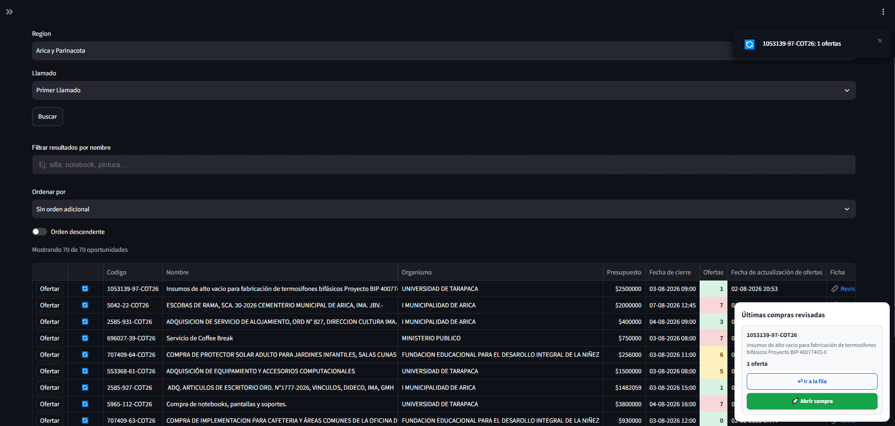

# Explorador de Compras Ágiles - Mercado Público

Aplicación web para explorar, filtrar y analizar oportunidades de Compra Ágil de Mercado Público.



La arquitectura desacopla completamente la obtención de datos de la interfaz, permitiendo mantener una base de datos actualizada de forma automática y consultar las compras con alta velocidad.

## Demo

Aplicación:

https://streamlit-production-9447.up.railway.app/

---

## Arquitectura

```
                    Mercado Público API
                             │
                             ▼
                    Sincronizador Python
                             │
                             ▼
                        PostgreSQL
                             │
                  ┌──────────┴──────────┐
                  ▼                     ▼
              FastAPI              Automatizador
                  │
                  ▼
              Streamlit
```

---

## Características

- Sincronización automática de Compras Ágiles.
- Actualización incremental por ventana de tiempo.
- Base de datos PostgreSQL.
- API propia desarrollada con FastAPI.
- Interfaz desarrollada con Streamlit.
- Actualización automática del número real de ofertas mediante la API del Buscador de Mercado Público.
- Reconciliación diaria para detectar compras que dejaron de estar publicadas.
- Exportación a Excel.
- Búsqueda rápida por nombre.
- Filtros por:
  - Región
  - Estado del llamado
  - Fecha de publicación
  - Fecha de cierre
- Ordenamiento por columnas.
- Actualización manual de ofertas por compra.

---

## Tecnologías

- Python
- FastAPI
- Streamlit
- PostgreSQL
- SQLAlchemy
- Requests
- OpenPyXL
- Railway

---

## Servicios desplegados

La aplicación se encuentra dividida en cuatro servicios independientes:

- PostgreSQL
- FastAPI
- Streamlit
- Automatizador

Esta arquitectura permite que la actualización de datos continúe funcionando incluso con el computador del desarrollador apagado.

---

## Extensión de Chrome (Opcional)

Para utilizar la funcionalidad de apertura directa y comunicación con Mercado Público se requiere instalar la siguiente extensión:

https://github.com/M-Munoz-cl/explorador-compra-agil-bridge-extension

La extensión actúa como puente entre la aplicación Streamlit y el portal de Compra Ágil de Mercado Público.

---

## Ejecución local

### 1. Clonar repositorio

```bash
git clone https://github.com/M-Munoz-cl/mercado-publico-postgres-fastapi.git
```

### 2. Crear entorno virtual

```bash
python -m venv .venv
```

### 3. Activar entorno

Windows

```bash
.venv\Scripts\activate
```

Linux

```bash
source .venv/bin/activate
```

### 4. Instalar dependencias

```bash
pip install -r requirements.txt
```

### 5. Configurar variables

Crear un archivo `.env`

```env
DATABASE_URL=...
TICKET=...
API_KEY=...
FASTAPI_URL=http://127.0.0.1:8000

INTERVALO_COMPRAS_DIA=240
INTERVALO_COMPRAS_NOCHE_TEMPRANA=900
INTERVALO_COMPRAS_MADRUGADA=1200

INTERVALO_OFERTAS=300

HORAS_VENTANA=2

HORA_RECONCILIACION=23
MINUTO_RECONCILIACION=30
```

---

## Ejecutar servicios

FastAPI

```bash
uvicorn main:app --reload
```

Streamlit

```bash
streamlit run streamlit_app.py
```

Automatizador

```bash
python automatizador.py
```

---

## Flujo de datos

```
Mercado Público
        │
        ▼
Sincronizador
        │
        ▼
PostgreSQL
        │
        ▼
FastAPI
        │
        ▼
Streamlit
```

La actualización del número de ofertas utiliza la API del Buscador de Mercado Público y se ejecuta automáticamente mediante el servicio Automatizador.

---

## Estado del proyecto

Proyecto en desarrollo activo.

Próximas funcionalidades:

- Seguimiento de Compras Ágiles.
- Notificaciones automáticas.
- Mejoras en el puente con la extensión de Chrome.
- Nuevas herramientas para apoyo a la preparación de ofertas.